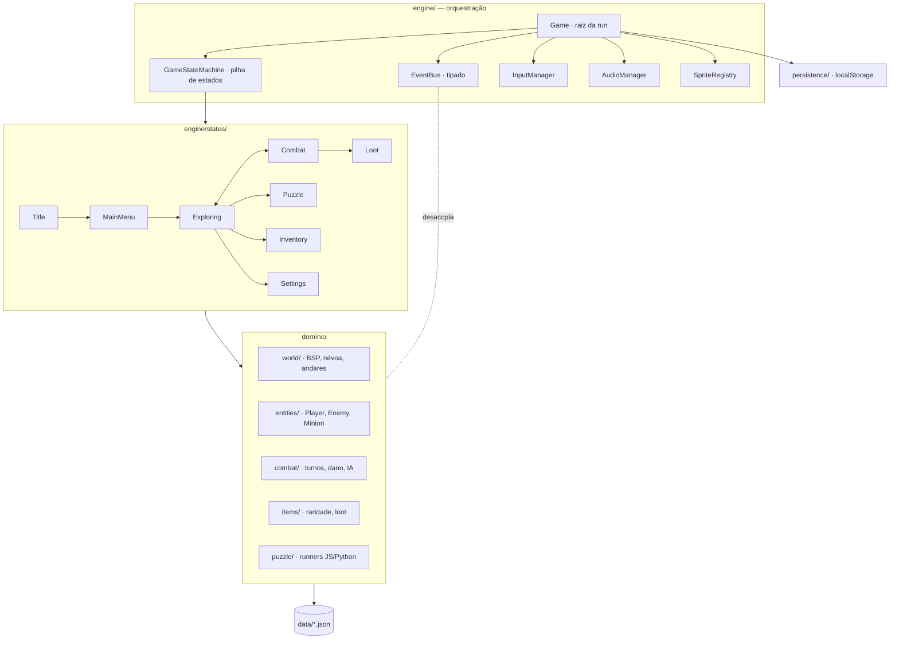
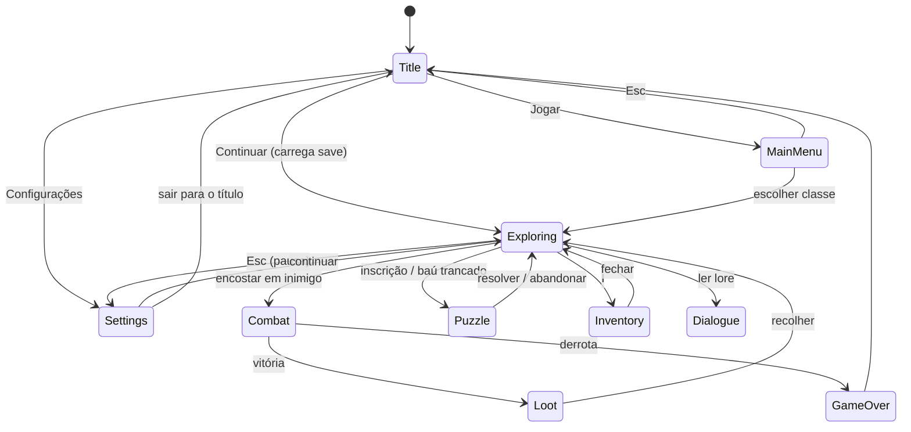
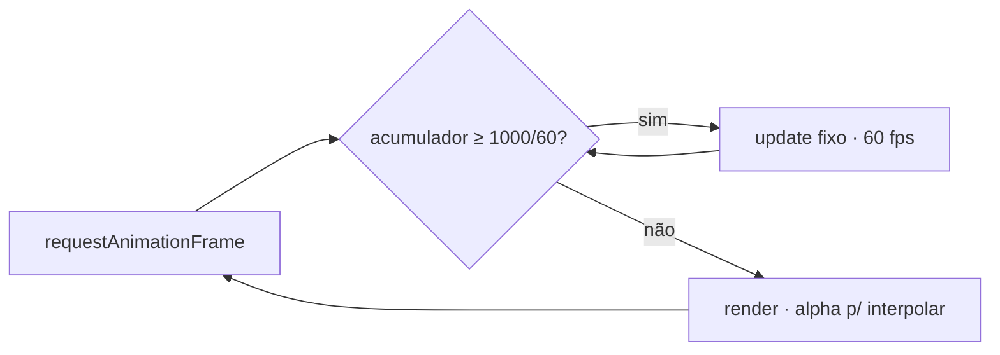
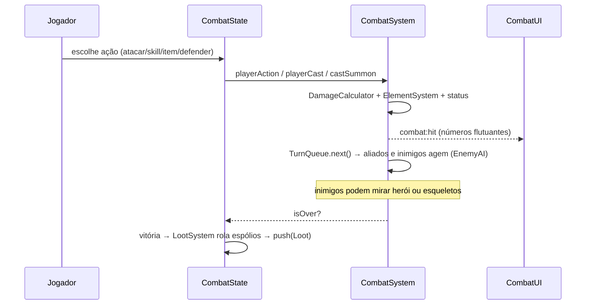
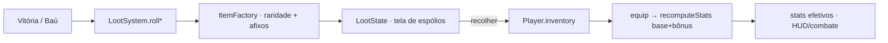
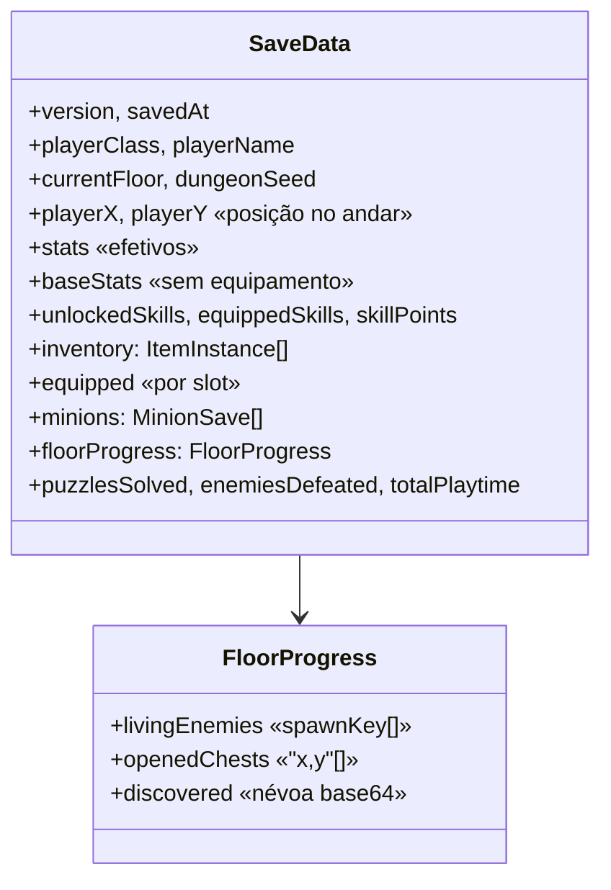

# 👑 Abyssal Crown

**Abyssal Crown** é um roguelike de masmorra por turnos onde os cofres do abismo
não são abertos com chaves, mas com **código**. Desça, decifre, sobreviva.

Cada andar esconde puzzles de programação e lógica que destrancam baús, escadas e
segredos. Entre eles, combate tático por turnos com sistema elemental, árvore de
habilidades por classe, equipamento com raridade, invocação de aliados e geração
procedural de masmorras — tudo no navegador, sem instalar nada.

> Feito com **TypeScript + Vite + Canvas 2D**, sem framework de jogo. Roda 100% no
> cliente e é publicado de graça no **GitHub Pages**. Sem backend.

---

## Índice

- [Como jogar](#-como-jogar)
- [Controles](#-controles)
- [Sistemas de jogo](#-sistemas-de-jogo)
- [Puzzles](#-puzzles)
- [Arquitetura](#-arquitetura)
  - [Visão geral](#visão-geral-das-camadas)
  - [Máquina de estados](#máquina-de-estados-de-jogo)
  - [Loop e eventos](#loop-fixo--barramento-de-eventos)
  - [Combate](#fluxo-de-combate)
  - [Loot & itens](#loot-e-itens)
  - [Persistência](#persistência-e-save)
- [Rodando localmente](#-rodando-localmente)
- [Adicionando conteúdo](#-adicionando-conteúdo)
- [Deploy](#-deploy-github-pages)
- [Créditos](#-créditos)

---

## 🎮 Como jogar

A partir da **tela-título** (a entrada da masmorra) você escolhe **Jogar**,
**Continuar** ou **Configurações**. Em jogo, você explora andares gerados
proceduralmente, luta em combates por turnos e abre cofres trancados resolvendo
puzzles no **Terminal Arcano** (em JavaScript ou Python).

Ao vencer combates ou abrir baús, recolhe **espólios** numa tela dedicada; equipa
armas, armaduras e acessórios (com raridade e bônus aleatórios) pelo **inventário**;
ganha XP e gasta pontos na constelação de habilidades — descendo cada vez mais
fundo até o Boss do andar 10.

O progresso é retomável: **Continuar** devolve você à **posição exata** onde parou,
com inimigos derrotados, baús abertos e a névoa já explorada preservados.

---

## ⌨️ Controles

| Tecla | Ação |
|---|---|
| **Setas** / **WASD** | Mover · navegar menus |
| **Enter** / **Espaço** | Confirmar |
| **Esc** | Menu de pausa (em jogo) · voltar |
| **E** | Interagir — um aviso `[E]` aparece quando há baú/inscrição ao lado |
| **I** | Abrir o inventário (equipar / usar itens) |
| **Q** | Usar rapidamente o melhor consumível |
| **K** | Abrir a árvore de habilidades |
| **P** | Salvar o jogo |

No **Terminal Arcano**: **Tab** insere 2 espaços, **Enter** mantém a indentação
(auto-indent para Python), **Ctrl/Cmd + Enter** roda o código (botão **EXECUTAR**).
A linguagem é detectada pelo código — funciona mesmo sem trocar a aba.

---

## 🧩 Sistemas de jogo

### Classes

| Classe | Estilo |
|---|---|
| **Cavaleiro Amaldiçoado** | Tanque de corpo a corpo; ramo **físico**. |
| **Arquimago Exilado** | Dano mágico elevado, frágil; ramo **arcano**. |
| **Paladino Caído** | Equilíbrio entre proteção e ataque; ramo de **fogo** + curas. |
| **Necromante Solitário** | Magia sombria, **choque** e **invocação de esqueletos**. |

Cada classe só acessa as habilidades do(s) seu(s) ramo(s) — derivado das
`startingSkills` em `classes.json`. As 4 habilidades de combate são equipáveis em
slots e podem ser trocadas a qualquer momento pela árvore (**K**).

### Itens, equipamento e companheiros

- **Espólios** com **raridade** (Comum / Raro / Épico) e **afixos rolados** que
  escalam com o andar.
- **3 slots de equipamento** (Arma / Armadura / Acessório) num modelo `base + bônus`
  totalmente reversível. A arma aparece sobreposta ao herói no combate; a armadura
  aplica um tinte de cor por tier.
- **Inventário** com comparação de bônus (▲/▼) e barras de HP/Mana.
- **Poções** em três tamanhos e loot que melhora com a profundidade.
- **Invocação (Necromante):** esqueletos entram na ordem de turnos, atacam sozinhos,
  podem ser alvo dos inimigos e **persistem entre combates** enquanto vivos.

---

## 🔐 Puzzles

São **40 puzzles** (4 por andar; 1 obrigatório + 3 opcionais), **sorteados
aleatoriamente** dentro do andar (mesma dificuldade), com dificuldade crescente:

| Andar | Tema |
|---|---|
| 1 | Fundamentos — loops e condicionais |
| 2 | Strings — manipulação de texto |
| 3 | Funções — definição e uso |
| 4 | Funções avançadas — anagramas, flatten |
| 5 | Listas — two sum, rotação |
| 6 | Dicionários — inverter, agrupar |
| 7 | Algoritmos — busca binária, ordenação |
| 8 | Algoritmos II — grid, dois ponteiros |
| 9 | Recursão — Fibonacci, Hanói |
| 10 | Boss composto — busca + padrão + cifra |

A função do jogador chama-se sempre `solution`; cada `input` é a lista de
argumentos. Validação por igualdade estrutural. Detalhes em
[docs/PUZZLE_CURRICULUM.md](docs/PUZZLE_CURRICULUM.md).

---

## 🏛 Arquitetura

**TypeScript** (`strict`, `verbatimModuleSyntax`) + **Vite** + **Canvas 2D**, sem
framework. Todo o jogo é desenhado num único `<canvas>`; o conteúdo vive em JSON.

### Visão geral das camadas



| Camada | Papel |
|---|---|
| **engine/** | Laço do jogo, máquina de estados, input, câmera, áudio, sprites. O `Game` é a raiz: possui canvas, subsistemas, catálogo de dados e o estado da run. |
| **engine/states/** | Telas/modos como estados na pilha. Overlays `transparent` deixam o estado de baixo continuar desenhando (puzzle, espólios, inventário, pausa). |
| **world/** | Geometria procedural: `BSPGenerator` (determinístico por andar), `FogOfWar` (shadowcasting + serialização), `DungeonLevel` (serializa/restaura o progresso do andar). |
| **entities/** | `Entity` base; `Player` (base vs stats efetivos, equipamento, minions), `Enemy` (`spawnKey` estável), `Minion` (aliado invocado). |
| **items/** | `ItemFactory` (raridade/afixos), `LootSystem` (loot por andar), `ItemText` (formatação para UI). |
| **combat/** | `TurnQueue` por velocidade, `DamageCalculator`, `ElementSystem`, `StatusEffect`, `EnemyAI`. |
| **puzzle/** | `PuzzleSystem` + `ArcaneTerminal` (overlay) rodando `JsRunner` (sandbox) ou `PyodideRunner` (Python/WASM). |
| **ui/** | Renderizadores de canvas: HUD, CombatUI, LootUI, InventoryUI, TitleUI, SettingsUI, SkillTreeUI. |
| **persistence/** | `SaveSystem`/`SaveData` em localStorage, versionado, com migração. |

### Máquina de estados de jogo

A `GameStateMachine` é uma **pilha**: `change` troca o topo, `push`/`pop` empilham
overlays. Estados `transparent` deixam o de baixo renderizar.



### Loop fixo & barramento de eventos



- **Fixed timestep a 60 fps:** a simulação roda em passos fixos de `1000/60 ms`; a
  renderização recebe um `alpha` para interpolar posições. Física estável
  independente da taxa de quadros.
- **EventBus desacopla os sistemas:** um barramento tipado liga os subsistemas por
  eventos (`enemy:defeated`, `puzzle:solved`, `combat:hit`, `toast`, `LOOT_DROPPED`,
  …). O combate não conhece a progressão; a progressão não conhece a renderização.

### Fluxo de combate



### Loot e itens

Itens são **instâncias** (`ItemInstance`): `defId` + `rarity` + `affixes` rolados.
O `LootSystem` gera espólios por andar (raridade pesa para melhor com a
profundidade); a coleta acontece na tela de espólios.



### Persistência e save

- **100% local** via `localStorage` (chave `abyssal_crown_v1`). Preferências de
  áudio numa chave separada (`abyssal_crown_audio`). **Sem backend.**
- Esquema em **`SAVE_VERSION = 2`** com **migração v1→v2** (`migrateSave`). O
  payload guarda:



- O layout de cada andar é **determinístico por andar**, então regenerar produz os
  mesmos inimigos/baús — o que permite reaplicar o `FloorProgress` por
  posição/`spawnKey` e retomar exatamente onde parou.
- **Quando salva:** ao descer escadas, ao fechar um puzzle e pelo menu de pausa
  (Esc) ou tecla **P**. **Nunca durante o combate.**

Mais detalhes em [docs/ARCHITECTURE.md](docs/ARCHITECTURE.md).

---

## 🚀 Rodando localmente

Requer **Node.js 18+**.

```bash
npm install
npm run dev      # http://localhost:5173
```

Outros scripts:

```bash
npm run build    # checagem de tipos (tsc) + bundle de produção em dist/
npm run preview  # serve o build de produção localmente
npm test         # suíte de testes (Vitest)
```

---

## ➕ Adicionando conteúdo

Quase todo o conteúdo é **dirigido por dados** — dá para contribuir **sem escrever
TypeScript**, apenas editando JSON em `src/data/`:

| Conteúdo | Arquivo |
|---|---|
| Puzzle | `data/puzzles.json` |
| Classe | `data/classes.json` (+ sprite no pacote) |
| Inimigo | `data/enemies.json` |
| Skill (inclui invocação) | `data/skills.json` |
| Item / equipamento | `data/items.json` |
| Lore | `data/lore.json` |

Passo a passo e exemplos completos em
[docs/ADDING_CONTENT.md](docs/ADDING_CONTENT.md). Sobre a evolução do projeto e os
contratos que não devem mudar, ver [docs/SCALING.md](docs/SCALING.md).

---

## 🌐 Deploy (GitHub Pages)

```bash
npm run deploy   # build + publica a pasta dist/ na branch gh-pages
```

O `vite.config.ts` usa `base: './'`, então o build funciona em qualquer subcaminho
do GitHub Pages. Hospedagem **gratuita e permanente**, sem servidor.

---

## 🎨 Créditos

- **Arte:** [0x72 DungeonTileset II](https://0x72.itch.io/dungeontileset-ii) por
  **0x72** — licença **CC0** (domínio público). Convenções de nomes em
  [docs/ASSETS.md](docs/ASSETS.md).
- **Código e design:** este projeto.
